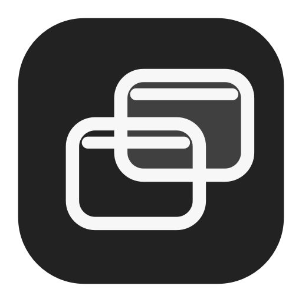
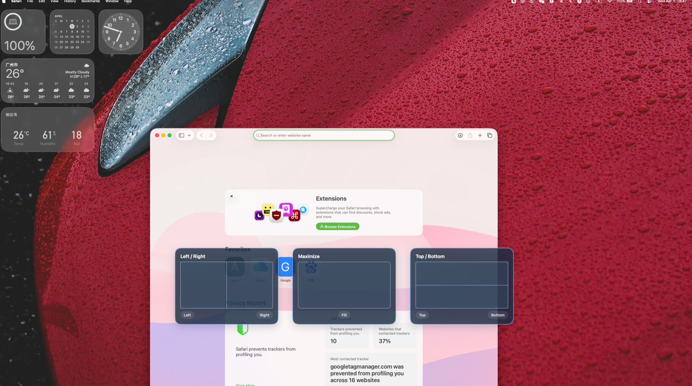
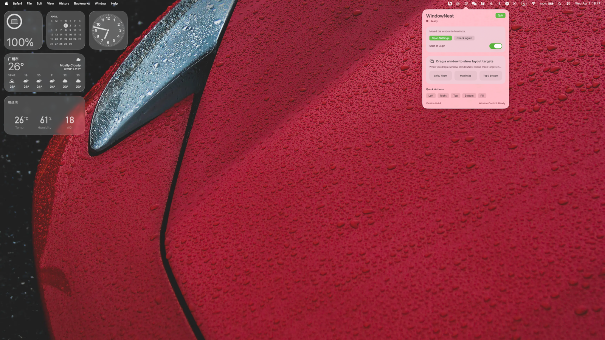

  

<h1 align="center">WindowNest</h1>

  A lightweight macOS menu bar app for snapping windows with a floating layout board.

  一款轻量的 macOS 菜单栏窗口整理工具，可通过浮动布局板快速贴靠窗口。

  
  
  

  <a href="./dist/WindowNest-0.4.6-Installer.dmg">Download DMG</a>
  ·
  <a href="./dist/WindowNest-0.4.6-macOS.zip">Download ZIP</a>

## Preview

### Drag Layout Board

### Menu Bar Panel

## Overview

WindowNest is designed for people who want faster window management on macOS without a heavy or complicated interface. It lives quietly in the menu bar and focuses on a drag-first experience: start dragging a window, move it onto one of the floating layout targets, and release to snap it into place.

WindowNest 为希望更高效管理 macOS 窗口的用户而设计，不依赖复杂笨重的界面，而是专注于轻量、直观的拖动式体验。应用常驻在菜单栏中，当你开始拖动窗口时，会在当前屏幕显示浮动布局目标区；将窗口移动到对应区域并松手后，即可快速完成贴靠。

## Downloads

Current packaged downloads:

| File | Purpose |
| --- | --- |
| [`WindowNest-0.4.6-Installer.dmg`](./dist/WindowNest-0.4.6-Installer.dmg) | Drag-to-Applications installer |
| [`WindowNest-0.4.6-macOS.zip`](./dist/WindowNest-0.4.6-macOS.zip) | Direct app archive |

## At A Glance

- Drag a window to reveal a floating layout board
- Snap into `Left / Right`, `Maximize`, or `Top / Bottom`
- Works with multiple displays
- Lives quietly in the menu bar
- Supports English, Simplified Chinese, and Traditional Chinese

## Features

- Drag-first window snapping with three large floating targets
- Layout groups for `Left / Right`, `Maximize`, and `Top / Bottom`
- Multi-display support
- Menu bar quick actions as a manual fallback
- Launch at login support
- English, Simplified Chinese, and Traditional Chinese UI
- Lightweight native macOS interface built with SwiftUI and AppKit

## 功能特点

- 拖动窗口时自动显示三块浮动布局目标区
- 支持 `左 / 右半屏`、`全屏`、`上 / 下半屏`
- 支持多显示器场景
- 提供菜单栏快速布局作为手动备用入口
- 支持开机启动
- 支持英文、简体中文、繁体中文
- 基于 SwiftUI 和 AppKit 构建，界面轻量且原生

## How It Works

1. Start dragging a window from its title bar area.
2. WindowNest shows three layout targets on the active screen.
3. Move the pointer onto the target you want.
4. Release the mouse to snap the window into place.

## 使用方式

1. 从窗口标题栏区域开始拖动窗口。
2. WindowNest 会在当前屏幕显示三个浮动布局目标区。
3. 把鼠标移动到想要的布局区域上。
4. 松手后，窗口会自动贴靠到对应位置。

## Installation

1. Download the latest `.dmg` or `.zip` from the `dist` folder.
2. If you use the DMG, open it and drag `WindowNest.app` into `Applications`.
3. Launch `WindowNest.app`.

You can also run the installed app directly from:

- [WindowNest.app](/Applications/WindowNest.app)

## Permissions

WindowNest needs these macOS permissions to control other apps' windows:

- `Accessibility`
- `Input Monitoring`

Grant both permissions to `WindowNest.app` in `System Settings -> Privacy & Security`.

WindowNest 需要以下 macOS 权限来控制其他应用窗口：

- `辅助功能`
- `输入监控`

请在 `系统设置 -> 隐私与安全性` 中为 `WindowNest.app` 开启这两项权限。

## Development

1. Open [WindowNest.xcodeproj](/Users/sunny/本地文件/Codex/WindowNest/WindowNest.xcodeproj) in Xcode.
2. Build and run the `WindowNest` target.
3. Grant the required permissions to the built app.
4. Drag a window to test the floating layout board.

## Roadmap

- Continue refining drag detection stability across different apps
- Improve multi-display behavior and edge cases
- Add more polished onboarding and product visuals
- Move packaged downloads into GitHub Releases

## Product Notes

- Bundle identifier: `com.windownest.app`
- App name stays `WindowNest` in every supported language
- The product is intentionally original and does not copy proprietary code or assets from other apps
